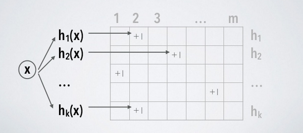
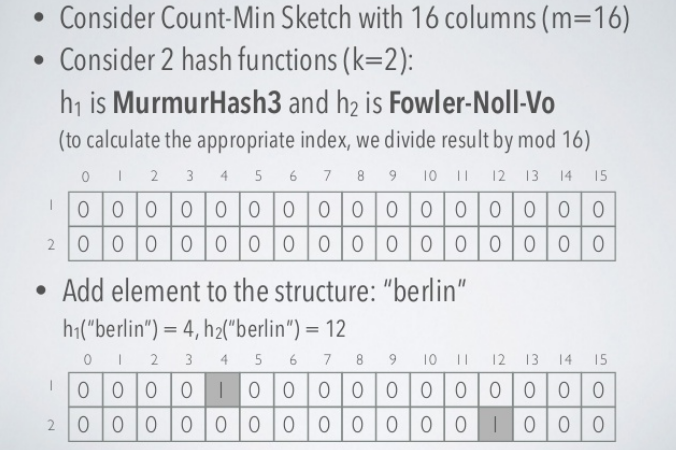
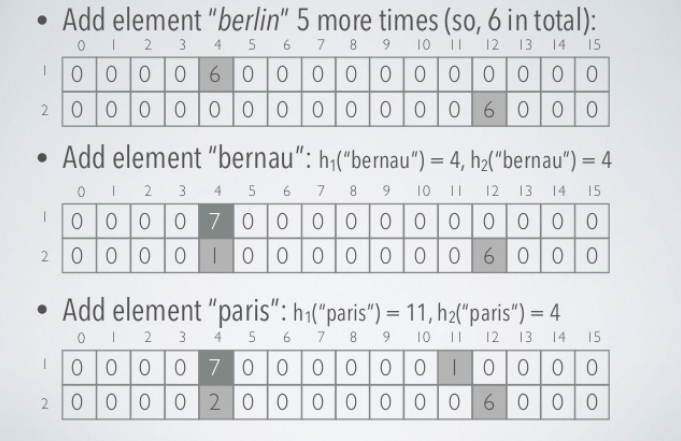
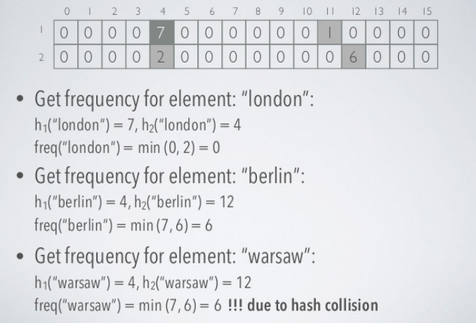
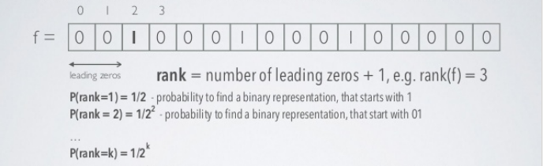
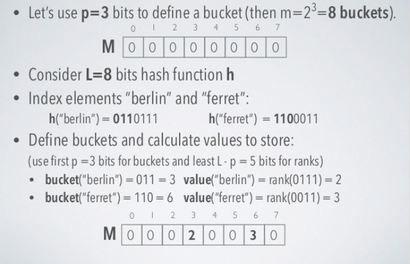
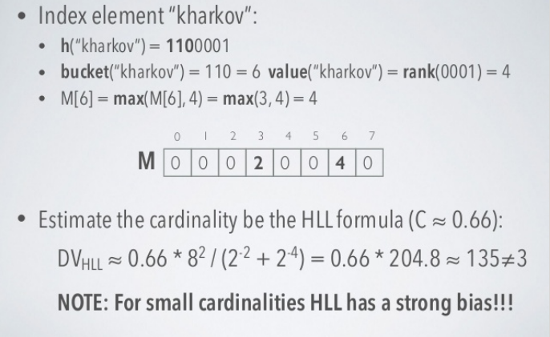
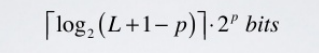
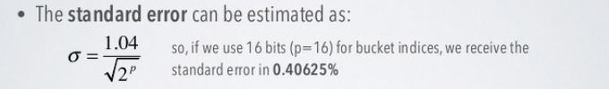

# Khái niệm

## Cấu trúc dữ liệu

-   `Probabilistic  data structures` không đưa ra kết quả chính xác mà là đưa ra một xấp xĩ gần đúng với câu trả lời hay kết quả của bài toán. Chúng cực kì hữu hiệu đối với big data và streaming application bởi vì có thể giảm thiểu đáng kể dung lượng bộ nhớ cần thiết so với các cấu trúc đưa ra kết quả chính xác
-   Trong phần lớn các cấu trúc dữ liệu này sử dụng hash function làm ngẫu nhiên hóa các items. Điểm mạnh:
    -   Tốn ít bộ nhớ - có thể control được bao nhiêu
    -   Dễ dàng thực hiện song song - hashes độc lập
    -   Có thời gian truy vấn constant - không khấu hao liên tục như trong từ điển

-   Các cấu trúc thường dùng:
    -   Bloom Filters
    -   Cuckoo Filters
    -   Count Min Skectch
    -   HyperLogLog

### Bloom Filters - Membership

-   Khi insert data mới vào mảng thông thường, giá trị index (nơi data được add vào), không được quyết định bởi giá trị được add vào. Không có mối liên hệ trực tiếp giữa key và value. Do đó, nếu search tìm value phải duyệt tất cả indexs
-   Tuy nhiên với Hash table, ta có thể quyết định key hay index dựa trên hashing cái value. Sau đó đặt value vào đúng index trong danh sách. Điều này có nghĩa key được quyết định bằng value, khi cần tìm value chỉ việc hash value là tìm được index của nó, chỉ tốn O(1) thời gian tìm kiếm


-   Giả sử có một danh sách lớn các mật khẩu yếu và nó được lưu trữ trên một số máy chủ từ xa. Nó không thể tải chúng cùng một lúc trong bộ nhớ / RAM vì kích thước. Mỗi khi người dùng nhập mật khẩu của bạn, bạn muốn kiểm tra xem đó có phải là một trong những mật khẩu yếu hay không và nếu có, bạn muốn đưa ra cảnh báo để thay đổi mật khẩu thành thứ gì đó mạnh hơn. Bạn có thể làm gì? Vì bạn đã có danh sách các mật khẩu yếu, bạn có thể lưu trữ chúng trong bảng băm hoặc một cái gì đó tương tự và mỗi lần bạn muốn khớp, bạn có thể kiểm tra xem mật khẩu đã cho có trùng khớp không. Việc kết hợp có thể nhanh nhưng chi phí tìm kiếm trên đĩa hoặc qua mạng trên máy chủ từ xa sẽ làm cho nó chậm. Đừng quên rằng bạn sẽ cần phải làm điều đó cho mọi mật khẩu được cung cấp bởi mọi người dùng. Làm thế nào chúng ta có thể giảm chi phí?

-   Bloom filter có thể kiểm tra xem 1 giá trị nào đó `có thể ` nằm trong tập hợp hoặc `chắc chắn` không nằm trong tập hợp
-   Bloom filter bao gồm vector các bit có độ dài m, khởi tạo ban đầu là các bit 0
  


-   Khi add một item vào bloom filter, ta đưa nó vào k hàm hash khác nhau, ra được kết quả và set bit 1 vào các vị trí đó. Trong hash table ta chỉ dùng 1 hàm hash và chỉ lấy được 1 index duy nhất. Nhưng với Bloom filter có nhiều hàm hash và nhiều indexes


-   Ví dụ, với geeks ở trên, cho vào 3 hàm hash cho 3 giá trị là 1, 4, 7


-   Với input là nerd vào 3 hàm hash cho gía trị 3, 4, 5. Ta thấy index 4 đã đánh dấu trước đó bởi geeks


-   Bây giờ cần tìm kiếm từ "cat" ta vẫn thực hiện hash với 3 functions bình thường và được 1, 3, 7. Ta nhận thấy tất cả index đều đã được mark là 1. Ta có thể kết luận: "cat" có thể nằm trong list. Nhưng thực tế cat không nằm trong list, điều này khẳng định tính xác suất của Bloom filters
-   Nếu ta tìm kiếm và nhận thấy 1 trong các index bằng 0 thì chắc chắn value đó không nằm trong list
-   Nếu tất cả index đều bằng 1 thì có thể value nằm trong list
-   Bây giờ, quay lại ví dụ ‘mật khẩu mà chúng ta đã nói trước đó. Nếu chúng ta triển khai kiểm tra mật khẩu yếu với Bloom filter, có thể thấy rằng ban đầu, chúng ta sẽ đánh dấu Bloom filter của mình bằng danh sách mật khẩu, sẽ cung cấp cho chúng a một vectơ bit với một số chỉ mục được đánh dấu là '1' và các chỉ số khác còn lại là 0. Vì kích thước của Bloom filter sẽ không lớn và sẽ có kích thước cố định, nó có thể dễ dàng được lưu trữ trong bộ nhớ và cả ở phía máy khách nếu cần. Đó là tại sao Bloom filter rất hiệu quả về mặt không gian. Khi một bảng băm yêu cầu có kích thước tùy ý dựa trên input data, Bloom filter có thể hoạt động tốt với kích thước cố định
-   Vì vậy, mỗi khi người dùng nhập mật khẩu của họ, chúng ta sẽ cung cấp mật khẩu cho các hàm băm và kiểm tra mật khẩu dựa trên vectơ bit. Nếu mật khẩu đủ mạnh, Bloom filter sẽ cho chúng ta thấy rằng mật khẩu chắc chắn không có trong danh sách mật khẩu yếu không thực hiện thêm bất kỳ truy vấn nào. Nhưng nếu mật khẩu có vẻ yếu và mang lại kết quả "maybe yếu" thì sẽ gửi nó đến máy chủ và kiểm tra danh sách thực tế  để xác nhận


-   Bloom filter cơ bản hỗ trợ 2 phương thức chủ yếu là: test và add
-   Test kiểm tra xem phần tử có nằm trong list hay không
-   Add thêm phần tử mới vào list
-   Bloom filter nếu remove phần tử thông thường sẽ gây nên tình trạng false negative, tức là kết luận phần tử không nằm trong list nhưng lại sai
-   Nếu muốn dùng remove phải sử dụng Counting bloom filter. Thay vì lưu single bit của value, chúng ta sẽ lưu integer của value và bit vector sẽ trở thành integer vector. Khi đó thay vì set bit là 1 thì sẽ là tăng 1 đơn vị, kiểm tra thì xét > 0   
-   Bloom filter size và hash function:
    -   Nếu kích thước Bloom filter quá nhỏ thì tất cả các bit có thể bật 1 hết sau đó sẽ bị false positive cho tất cả input. Một filter lớn sẽ ít bị false positive hơn. Ta có thể điều chỉnh Bloom filter với độ chính xác chúng ta cần dựa trên false positive error rate
    -   Cần dùng bao nhiêu hash function? Càng nhiều thì càng nhanh đầy Bloom filter và càng chậm, quá ít hash function thì dễ bị false positve


-   Tăng số lượng hàm hash k, xác suất false positive giảm
-   Công thức tính xác suất false positive p dựa trên size filter m, số lượng hàm hash k và số phần tử được inserted n:

 

-   Ta cần xác định m và k, cần xác định xác suất sai số p trước và số phần tử n ta có thể tìm được m và k theo công thức:


### Cuckoo filter

-   Cuckoo filter cải thiện thiết kế của Bloom filter bằng việc đề xuất delete, giới hạn counting, xác suất false positive được giới hạn trong khi vẫn giữ được giống space complexity. Sử dụng Cuckoo để giải quyết đụng độ và bản chất là một bản băm cuckoo compact


-   Thực hiện:
    -   Cuckoo filter bao gồm bảng băm Cuckoo lưu trữ `fingerprints`của các items được chèn. Fingerprints của một item là một chuỗi bit có nguồn gốc từ hàm băm của items đó. Bảng băm cuckoo bao gồm một mảng các buckets trong đó một mục được chèn được ánh xạ tới hai nhóm có thể dựa trên hai hàm băm. Mỗi buckets có thể được cấu hình để lưu trữ một số lượng fingerprints khác nhau. Thông thường, Cuckoo filter được xác định bằng kích thước fingerprints và buckets của nó. Ví dụ: Cuckoo filter (2,4) lưu trữ fingerprints dài 2 bit và mỗi bucket trong bảng băm Cuckoo có thể lưu trữ tối đa 4 fingerprints.

-   Insertion:

    ```python
    f = fingerprint(x);
    i1 = hash(x);
    i2 = i1 ⊕ hash(f);

    if bucket[i1] or bucket[i2] has an empty entry then
    add f to that bucket;
    return Done;

    // must relocate existing items;
    i = randomly pick i1 or i2;
    for n = 0; n < MaxNumKicks; n++ do
    randomly select an entry e from bucket[i];
    swap f and the fingerprint stored in entry e;
    i = i ⊕ hash(f);
    if bucket[i] has an empty entry then
        add f to bucket[i];
        return Done;

    // Hashtable is considered full;
    return Failure;
    ```

-   Search:

    ```python
    f = fingerprint(x);
    i1 = hash(x);
    i2 = i1 ⊕ hash(f);

    if bucket[i1] or bucket[i2] has f then
        return True;

    return False;
    ```

-   Delete:

    ```python
    f = fingerprint(x);
    i1 = hash(x);
    i2 = i1 ⊕ hash(f);

    if bucket[i1] or bucket[i2] has f then
    remove a copy of f from this bucket;
    return True;

    return False;
    ```

-   Space complexity:
    -   Liên quan đến các bộ lọc cuckoo và bloom filter, chúng thực hiện khác nhau ở các xác suất false positive khác nhau. Khi xác suất false positive của bộ lọc nhỏ hơn hoặc bằng 3%, bộ lọc cuckoo có ít bit hơn cho mỗi mục nhập. Khi cao hơn, bộ lọc bloom filter có ít bit hơn cho mỗi mục nhập

-   Time complexity:
    -   Trong băm cuckoo, chèn một phần tử có vẻ tệ hơn nhiều so với O (1) trong trường hợp xấu nhất vì có thể có nhiều trường hợp trong khi va chạm, trong đó chúng ta phải xóa một giá trị để nhường chỗ cho giá trị hiện tại. Thêm vào đó, nếu có một chu kỳ thì toàn bộ bảng phải được thử lại

### Count min sketch - Frequency
-   Dùng để ước lượng số lần xuất hiện của 1 phần tử trong tập hợp
-   Là cấu trúc dữ liệu có không gian sublinear mà hỗ trợ:
    -   add phần tử vào cấu trúc
    -   count số lần đó phần tử được thêm vào
-   Được diễn tả bởi 2 thông số:
    -   m - số lượng các buckets (độc lập với n và nhỏ hơn)
    -   k - số lượng các hàm hash khác nhau (nhỏ hơn nhiều so với m)

-   Yêu cầu kích thước không gian cố định: m*k counters và k hash function
-   Đơn giản đó là một ma trận các biến đếm (khởi tạo 0)



-   Khi add phần tử vào sketch - tính toán tất cả k hàm hash và tăng biến đếm theo vị trí [i, hi(element)], i = 1 .. k
-   Bởi vì soft collisions, chúng ta có k ước lượng của tần số thực sự của phần tử bởi vì chúng ta không bao giờ giảm biến đếm nên chỉ có thể bị trường hợp overestimate
-   Để get tần số, ta tính tất cả k hàm hash và lấy giá trị nhỏ nhất của biến đếm trong vị trí [i, hi(element)]. i = 1 .. k
-   Thời gian cần để add và trả về tần số là hằng số O(k), giả định rằng các hash function có thể được đánh giá với constant time

    





-   Tính chất của Count min sketch:

    -   Chỉ trả về tần số lớn hơn hoặc bằng thực tế
    -   Để đạt được một xác suất sai số p, ta cần k >= ln(1/p)
        -   Với p khoảng 1% thì k = 5 khá hợp lí
    -   Count min sketch chủ yếu giống cấu trúc dữ liệu Bloom filter    
    -   Sự khác biệt ở cách sử dụng:
        -   Count min sketch có số ô gần như tuyến tính, phụ thuộc đến chất lượng xấp xỉ của sketch
        -   Bloom filter có số ô trùng với số lượng phần tử trong tập hợp

-   Ứng dụng:
    -   AT&T sử dụng Count Min Sketch trong chuyển đổi các mạng để thực hiện đánh giá các traffic network sử dụng memory giới hạn
    -   Ở Google sử dụng tiền thân của nó để thực hiện MapReduce kiến trúc xử lí song song

### HyperLogLog - Cardinality

-   Không gian phân biệt (Cardinality) của các tập hợp các số được phân bố thống nhất có thể được ước lượng bởi tối đa số 0 ở đầu trong biểu diễn nhị phân của mỗi số. Nếu giá trị value là k, số lượng các phần tử phân biệt trong tập hợp là 2^k



-   Đối với 2^k biểu diễn nhị phân, chúng  ta sẽ  tìm được ít nhất 1 đại diện với rank = k
-   Nếu ta tìm được rank lớn nhất có thể và nó bằng k, 2^k  là ước lượng xấp xỉ số phần tử 

-   Hyperloglog được biểu diễn bởi 2 thông số:
    -   p - số bits (xác định một bucket để dùng average), m = 2^p là số bucket 
    -   h - hash function, produces ra uniform hash values

-   Hyperloglog có thể ước lượng không gian phân biệt > 10^9 với độ lệch chuẩn 2%, sử dụng 1.5 kB bộ nhớ
-   Hyperloglog sử dụng việc ngẫu nhiên hóa để xấp xĩ cardinality của một multiset, việc random này dựa trên hàm hash
-   Quan sát số lượng bit 0 ở đầu lớn nhất đối với tất cả các giá trị hash
    -   Nếu mẫu bit 0(L-1)1 được quan sát bắt đầu của một giá trị hash (rank = L), nên ước lượng hợp lý kích thước tập là 2^L

-   Stochastic average (trung bình ngẫu nhiên) được dùng để giảm bớt sự đa dạng quá lớn:
    -   Input stream của data các phần tử S được chia thành m stream con Si sử dụng p bits đầu của giá trị hash (m = 2^p)
    -   Trong mỗi stream con, rank được đo một cách độc lập
    -   Các số này được lưu trong mảng các register M, M[i] lưu trữ maximum rank có thể có đối với stream con tại vị trí index i

-   Cardinality estimation được tính toán như normalized bias corrected harmonic mean của các ước lượng trên các stream con

-   Ví dụ
  
    

    

-   Yêu cầu cho không gian bộ nhớ không grow theo tuyến tính với L, đối với các hàm hash L bits và precision p: 

-   Đối với Hyperloglog sử dụng 32 bit hash code, yêu cầu 5.2^p bits

-   Không cần phải tính toàn bộ full hash code cho phần tử :
    -   p bits đầu và số số 0 đầu tiên của các bit còn lại là đủ

-   Tính chất Hyperloglog: 
    -   Thuật toán sai số lớn đối với không gian nhỏ
    -   

-   Ứng dụng:
    -   PFCOUNT trong Redis sử dụng HyperLogLog sử dụng 12kb per key để đếm với sai số 0.81%, không có giới hạn số lượng trừ phi tiếp cận 2^64 items

# Nguồn tham khảo
-   https://highlyscalable.wordpress.com/2012/05/01/probabilistic-structures-web-analytics-data-mining/
-   https://blog.vietnamlab.vn/2016/09/29/gioi-thieu-ve-bloom-filter/
-   https://hackernoon.com/probabilistic-data-structures-bloom-filter-5374112a7832

-   https://medium.com/techlog/cuckoo-filter-vs-bloom-filter-from-a-gophers-perspective-94d5e6c53299
