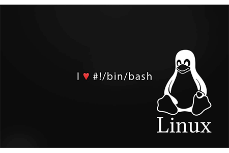

BASH(Linux Shell)
==================
*The shell is a program that takes commands from the keyboard and gives them to the operating system to perform*

    

## 1. Mục tiêu

- Tự đọc và nắm các thành phần cơ bản của Linux
- Cơ bản sử dụng được commandline, bashscript (grep, awk, sed, xargs, find, etc.) ở mức basic.

## 2. Tools

- Terminal
- `zsh`
- `oh-my-zsh`
- `vim`

## 3. Bài tập

### 3.1 Processing texts

- Count the number of lines satisfying a specific pattern in a log file
- Calculate KLOC of code C/C++ files in a directory

### 3.2 System

- Kill multiple processes following a patterns (using `awk`, `grep`, `xargs`)
- Kill processes opening a specific port (using `netstat`, `grep`...)
- List opennned ports, handles
- Find files via regular expressions, and remove them
- List, one at a time, all files larger than 100K in the /home/username directory tree. Give the user the option to delete or compress the file, then proceed to show the next one. Write to a logfile the names of all deleted files and the deletion times.

### 3.3 Shell Scripting

- Give you a text file which contains several numbers (may be serveral thousand), each on it's own line. You task is write a script which print the sum of all numbers in the file. I'm looking for effficient solution.
- Here is text file: [sample.data](./media/sample.data) (you can add more numbers to sample file).

## 4. Tài liệu tham khảo

- [Oh-My-Zsh! A Work of CLI Magic — Tutorial for Ubuntu](https://medium.com/wearetheledger/oh-my-zsh-made-for-cli-lovers-installation-guide-3131ca5491fb)
- [The Linux Command Line - William Shotts](./book/The-Linux-Command-Line-William-Shotts.pdf)
- [Bash Scripting Tutorial](https://linuxconfig.org/bash-scripting-tutorial-for-beginners)
- [Basic commands for Linux](https://maker.pro/linux/tutorial/basic-linux-commands-for-beginners)
- [Linux command](http://linuxcommand.org/)
- [UNIX / LINUX Tutorial](http://www.tutorialspoint.com/unix/)
- [Conquering the Command Line](http://conqueringthecommandline.com/book)
- [Shell Scripting: How to Automate Command Line Tasks Using Bash Scripting and Shell Programming](https://www.amazon.com/Shell-Scripting-Automate-Command-Programming/dp/151738043X)
- [vim](http://www.openvim.com/)
- [awk](https://www.tutorialspoint.com/awk/)
- [Shell Scripting Tutorial](https://www.shellscript.sh/index.html)
- [`nohup` command](https://en.wikipedia.org/wiki/Nohup)
- [Command line text processing](https://github.com/learnbyexample/Command-line-text-processing)
- [Developer Tools: The Command Line](https://dev.to/wuz/developer-tools-the-command-line-3f66)
