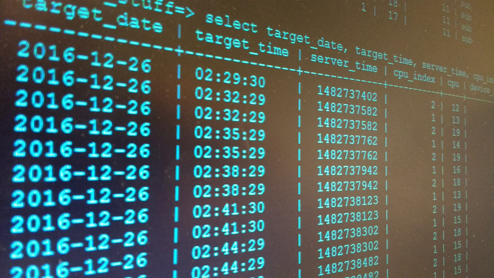

# Database Basic

>A database is an organized collection of data, stored and accessed electronically.

https://en.wikipedia.org/wiki/Database

    

## 0. Mục tiêu

- Nắm được kiến thức căn bản về cơ sở dữ liệu (database)
- Biết cách sử dụng database để lưu trữ và truy vấn dữ liệu
- Lựa chọn và thiết kế database phù hợp với từng bài toán

## 1. Nội dung

- Tìm hiểu các khái niệm về database
- Tìm hiểu SQL (Structure Query Language)
- Tìm hiểu và sử dụng MySQL
- Tìm hiểu và sử dụng Redis
- Thiết kế schema cho một ứng dụng (bài tập)

## 2. Tài liệu 

https://en.wikipedia.org/wiki/Database

SQL: 

- https://www.w3schools.com/sql/default.asp
- http://www.craigkerstiens.com/2019/02/12/sql-most-valuable-skill/

NoSQL:

- https://highlyscalable.wordpress.com/2012/03/01/nosql-data-modeling-techniques/
- https://mapr.com/blog/data-modeling-guidelines-nosql-json-document-databases/

Design:

- https://en.wikipedia.org/wiki/Database_design
- https://www.kidscodecs.com/database-design/
- https://www.guru99.com/database-design.html

Troubleshooting:

- [SQL Tuning or SQL Optimization](https://beginner-sql-tutorial.com/sql-query-tuning.htm)
- [Query Optimization](https://github.com/pingcap/tidb-academy-labs/blob/master/3-query-optimization.md)

## 3. Bài tập 

Thiết kế schema cho chương trình chat - trò chuyện (với Redis và với MySQL), sử dụng Python để tương tác.

Mô tả chương trình chat: cơ chế tương tự Zalo, Message. 

### 3.1. Cơ bản:

- Tạo tài khoản (username/password, email,...)
- Chọn người trò chuyện (theo username hoặc email)
- Hiển thị lịch sử trò chuyện (nếu có)
- Trò chuyện (chat)

### 3.2. Nâng cao:

- Kết bạn
- Chat trong nhóm
- Hiển thị trạng thái online/offline của người khác
- Hiện thị trạng thái tin nhắn (seen)

### 3.3. Hướng dẫn 

- Thiết kế hệ thống tài khoản 
- Thiết kế cấu trúc lưu trữ lịch sử chat
- Thiết kế cấu trúc lưu trữ nội dung tin nhắn 

## 4. Đánh giá

- Thiết kế đáp ứng được yêu cầu cơ bản
- Thiết kế đáp ứng được yêu cầu nâng cao
- Sáng tạo, phát triển và mở rộng bài toán 
- Ghi chép các vấn đề tìm hiểu hoặc gặp khó khăn

