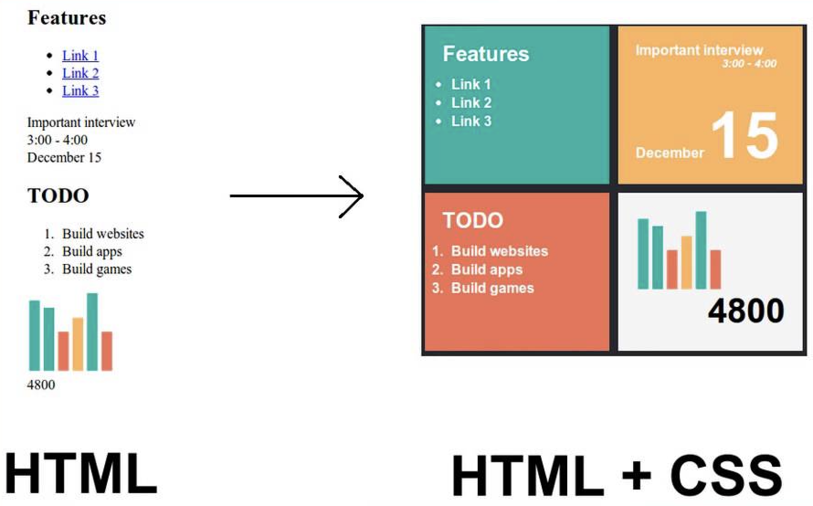
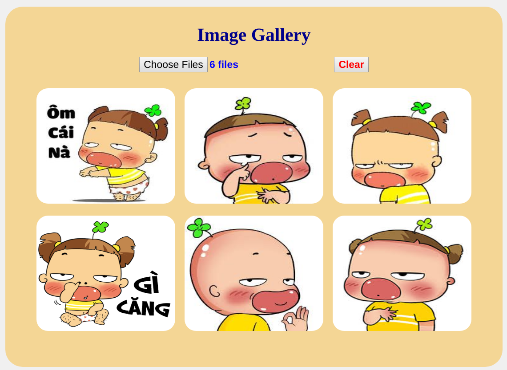
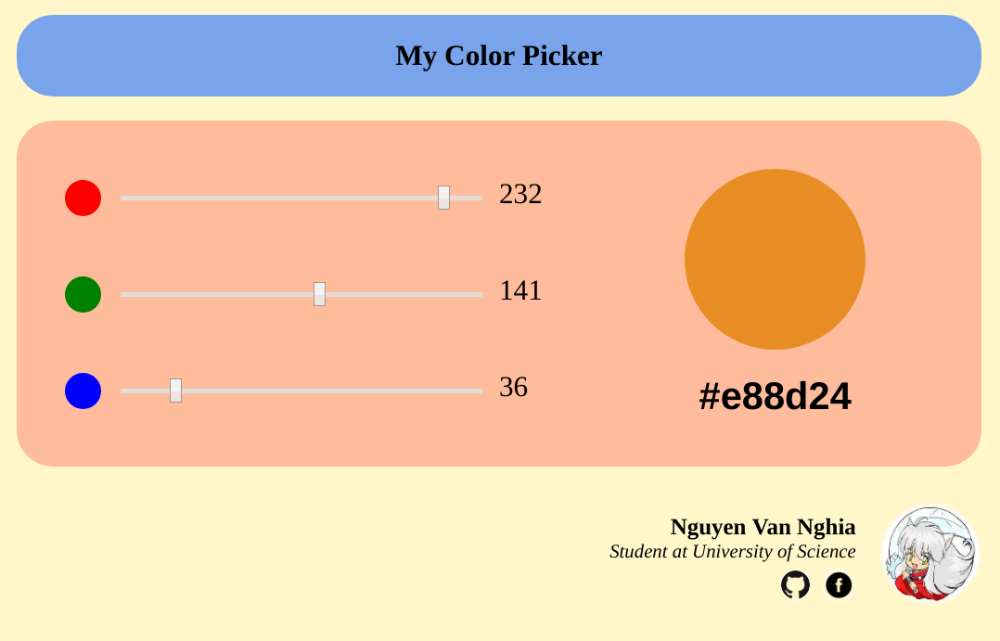

# Basic knowledge of Web development

## Lý thuyết

### Yêu cầu

- Mục tiêu phần này là cung cấp khái niệm cơ bản về Web Development:html, css, javascript
- Fresher tìm hiểu lý thuyết theo các keyword cung cấp, viết lại báo cáo dạng markdown.
- Phần này làm cá nhân.

## Kiến thức

### Frontend Basic
- **HTML5**
- **CSS3**. Chú ý: **Box Model**, **Flexbox**, **Media Queries**
- **Responsive Web Design**
- **Màu sắc trong thiết kế Web**?
- Tham khảo một số CSS Framework: **Bootstrap**, **Semantic UI**, ...

### JavaScript

- **JavaScript Syntax**
- Async trong JavaScript: **Callback**, **Promise**, **Async/Await**, **Callback hell**
- **Closure**
- OOP trong JavaScript: **Prototype**, **Class**
- Một số thư viện JavaScript: **lodash**, **moment**, ...

### Tham khảo
- [The Ultimate VSCode Setup for Front End/JS/React](https://medium.com/productivity-freak/the-ultimate-vscode-setup-for-js-react-6a4f7bd51a2)
- [Tutorial for HTML, CSS, JavaScript](https://www.w3schools.com/)
- [CORS](https://spring.io/understanding/CORS)
- [UI/UX](https://gitlab.zalopay.vn/vuongvx/ui-ux)

## Bài tập

### Yêu cầu

- Dùng những kiến thức nền tảng ở phần Lý thuyết để thực hiện các bài tập bên dưới.
- Phần này làm cá nhân.

### Phương thức đánh giá

- Review code.
- Hỏi đáp code để đánh giá độ thấu hiểu vấn đề.

### Đề bài

#### Basic JavaScript

*Mục tiêu*: 

- Làm quen với việc xử lý JavaScript.

*Mô tả*: Viết một static web cho phép chọn một loạt ảnh và hiển thị lên các khung.

*Yêu cầu*:

- Có một button để chọn các file ảnh từ disk.
- Sau khi chọn danh sách file đó, load hình lên và hiển thị hình ảnh trên các khung.
- Có một nút clear để remove hình và reset các file được chọn.

Tỉ lệ kiến thức cần để thực hiện: HTML (20%), CSS (20%), JavaScript (60%).

*Các bước làm*:
- Suy nghĩ hướng bố trí giao diện, dựng giao diện.
- Viết xử lý giao diện bằng JavaScript.

*Tham khảo*:

#### Color Chooser

*Mục tiêu*:

- Làm quen với HTML/CSS.

*Mô tả*: Xây dựng một ứng dụng Web đơn giản cho phép người dùng chọn các chỉ số RGB để lấy mã màu.

*Tính năng gồm có*:

- Các thanh trượt cho phép người dùng chọn các giá trị màu RGB.
- Khung thể hiện màu tổng hợp được chọn và mã màu của nó.
- Xem thông tin tác giả viết ứng dụng.

Tỉ lệ kiến thức cần để thực hiện: HTML (20%), CSS (60%), JavaScript (20%).

*Các bước làm*:
- Nhìn ứng dụng mẫu, suy nghĩ hướng bố trí thẻ, phân vùng sao cho dễ dàng layout nhất.
- Suy nghĩ cách lấy giá trị màu, hiển thị màu, thuật toán tìm màu.
- Dựng trang HTML theo hướng bố trí đã suy nghĩ.
- Dựng CSS để hoàn thiện giao diện.
- Xử lý JavaScript theo thuật toán đã suy nghĩ.
- Hiệu chỉnh lại giao diện, bố trí.

*Tham khảo*:

