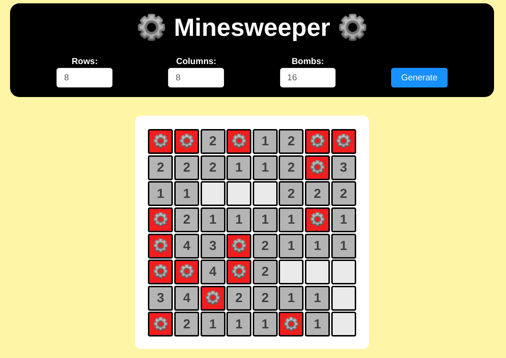

# Advance knowledge of Web development

## Lý thuyết

### Yêu cầu

- Mục tiêu phần này là cung cấp khái niệm advance hơn về Web Development: layout, javascript framework: ReactJs.
- Fresher tìm hiểu lý thuyết theo các keyword cung cấp, viết lại báo cáo dạng markdown.
- Phần này làm cá nhân.

## Kiến thức

## HTTP và Restful API

- **AJAX**
- HTTP Method: **GET**, **POST**, **PUT**, **DELETE**, ...
- **CORS**
- **Session**, **Cookie**, **JWT**
- **Restful API** là gì? **Design Restful API** như thế nào?
- **Server Render** và **Single Page App**
- Các công cụ hỗ trợ thiết kế Restful API: **Swagger**, **Postman**, ...
 
## ReactJS

- **ReactJS**: principles, **Component**, **State và Props**, **Life Cycle**, **JSX**, ...
- **Create-react-app**, **NextJS**
- **React Router**
- State Management: **Redux**, **MobX**. Khi nào cần dùng một State Management?
- Các React Framework: **Ant.design**, **React Bootstrap**, **RechartsJS**, ...

## Tham khảo

- [HTTP Methods](https://www.tutorialspoint.com/http/http_methods.htm)
- [Json Web Token](https://jwt.io/)
- [Restful API Design](https://hackernoon.com/restful-api-designing-guidelines-the-best-practices-60e1d954e7c9)
- [React Router](https://reacttraining.com/react-router/web/example/basic)
- [ReactJS Documentation](https://reactjs.org/docs/getting-started.html)
- [Ant.design](https://ant.design/)
- [Redux](https://insights.innovatube.com/redux-th%E1%BA%ADt-l%C3%A0-%C4%91%C6%A1n-gi%E1%BA%A3n-ph%E1%BA%A7n-1-76a3fa2c31ab)
- [Learn how to use JSON Web Tokens (JWT) for much Authentication win!](https://github.com/dwyl/learn-json-web-tokens)

## Bài tập

### Yêu cầu

- Dùng những kiến thức nền tảng ở phần Lý thuyết để thực hiện các bài tập bên dưới.
- Phần này làm cá nhân.

### Phương thức đánh giá

- Review code.
- Hỏi đáp code để đánh giá độ thấu hiểu vấn đề.

### Đề bài

#### Minesweeper

*Mục tiêu*:

- Làm quen với ReactJS.
- Có thể áp dụng Redux vào bài này để quen tay.
- Viết thuật toán bằng JavaScript.
- Dùng một CSS Framework hoặc React Framework để thiết kế giao diện nhanh hơn.

*Mô tả*:

- Minesweeper là một trò chơi kinh điển.
- Sẽ có một số ô bom ẩn mình, các ô còn lại sẽ chứa một con số. Số này là số lượng bom xung quanh ô đó.
- Mục tiêu: điền vào số lượng bom, render ra map game. Map game là một bảng các ô đã mở hết.
- Giao diện map game tham khảo các game Minesweeper hiện có trên thị trường.

*Tính năng gồm có*:

- Ô nhập số lượng bom. Kích thước map game tùy ý.
- Nút Tạo map. Khi nhấn nút này thì map game sẽ được tạo ra.

*Các bước làm*:
- Suy nghĩ giao diện, bố trí mapgame và các nút.
- Thiết kế global state (nếu có dùng Redux).
- Suy nghĩ thuật toán để tạo ra map game.
- Implement xử lý.

*Tham khảo giao diện*

