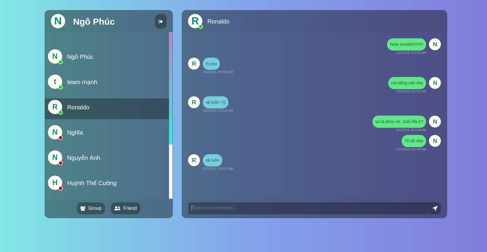
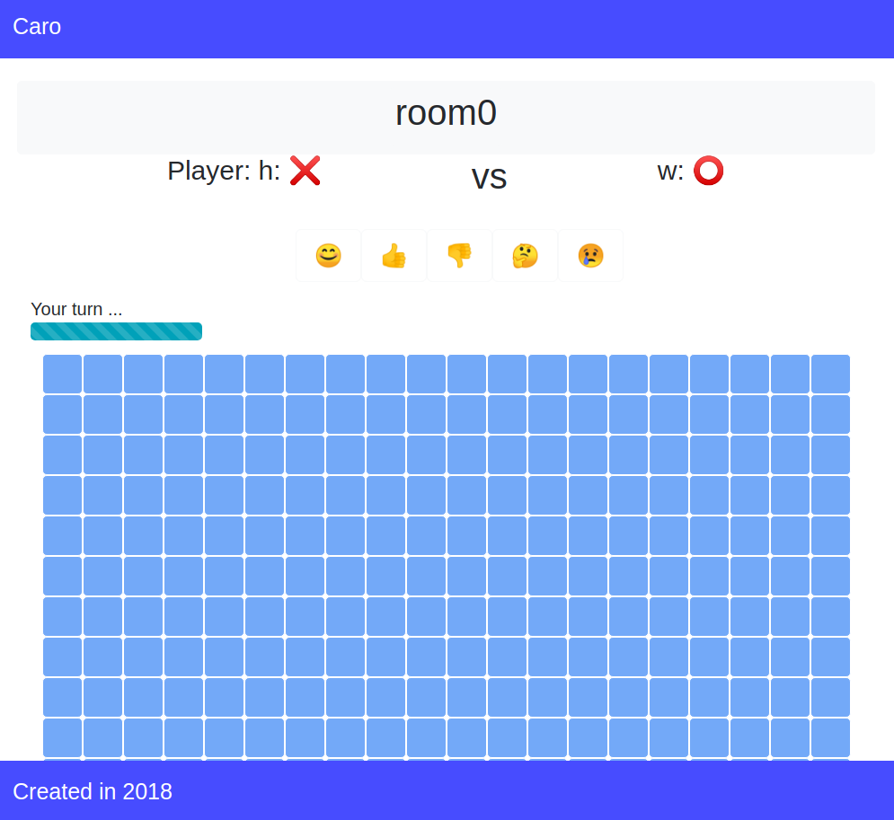

# Final Assignment

## Yêu cầu

- Fresher vận dụng kiến thức ở phần Lý thuyết và Bài tập để xây dựng nên một ứng dụng hoàn chỉnh.
- Phần này làm theo nhóm 2 người hoặc solo (nếu đủ khả năng).
- Có 2 đề bài, Fresher **chọn 1 trong 2 đề bài** để làm. Mỗi bài sẽ có tiêu chí đánh giá riêng.

## Phương thức đánh giá

- Seminar trình bày.
- Nội dung trình bày phải thỏa tiêu chí đánh giá riêng của đề bài.

## Tham khảo 

- [zalopay-vertx-http-api](https://gitlab.zalopay.vn/zalopay-oss/zalopay-vertx-http-api): Simple way to build up a web api with vertx

- Chú ý về cách viết unittest (advanced) 

## Đề bài

---

### Đồ án 1: Perfect Chat

#### Yêu cầu

- Xây dựng một ứng dụng chat có các tính năng sau:
    - Đăng nhập/Đăng ký.
    - Hỗ trợ chat giữa 2 user hoặc chat nhóm.
    - Hỗ trợ notification khi có tin nhắn mới.
    - Hiển thị lịch sử chat trong khung chat.
    - Có thể đề xuất thêm chức năng khác nếu thích (bonus điểm).
- Frontend sử dụng ReactJS. Giao diện có thể tham khảo Zalo PC hoặc FB Messenger.
- Backend sử dụng NodeJS hoặc Java.
- Database có thể dùng MongoDB, Redis, hoặc RocksDB (recommended).
- Có thể dùng Swagger để thiết kế API.

#### Công nghệ bắt buộc sử dụng

- Sử dụng JWT để authenticate các API call.
- Frontend sử dụng ReactJS với Ant.design.
- Dùng Redux để làm State management.

#### Hướng dẫn

- Xác định các chức năng mà app của em hỗ trợ.
- Thiết kế các màn hình theo các chức năng trên.
- Thiết kế database để lưu trữ dữ liệu. Nên lưu ý cách thiết kế DB trên document-base DB và key-value store sẽ khác nhau. Nên cân nhắc lựa chọn loại DB phù hợp.
- Thiết kế API. API là phần quan trọng để giao tiếp giữa frontend và backend, cần thiết kế một cách cẩn thận trước khi bắt đầu code.
- Thiết kế API cho phần Socket.
- Backend:
    - Implement các API.
    - Verify tính đúng đắn của API dùng **Postman** hoặc **Insomnia**.
- Frontend:
    - Implement các component giao diện.
    - Thiết kế global state (nếu có dùng Redux)
    - Implement các xử lý trên Frontend.

#### Tham khảo giao diện

### Đồ án 2: Best Caro

#### Yêu cầu

- Xây dựng một ứng dụng chơi cờ Caro hỗ trợ những chức năng sau:
    - Đăng nhập/Đăng ký.
    - Tạo bàn chơi (Bàn chơi gồm 2 người, user sẽ tạo bàn chơi và chờ người khác join vào để bắt đầu chơi).
    - Join bàn chơi.
    - Chơi game.
    - Xem statistics thắng thua.
    - (Optional) Nếu có hệ thống cược điểm ở mỗi bàn chơi sẽ được bonus **15 điểm**.
    - (Optional) Nếu có AI (chơi với máy, thuật toán bất kỳ: minmax, ...) sẽ được bonus **20 điểm** (tuy nhiên, phải hiểu thuật toán).
    - (Optional) Hỗ trợ chat trong khi chơi sẽ được bonus **10 điểm**.

- Backend sử dụng NodeJS hoặc Java.
- Database có thể dùng MongoDB (recommended), Redis, hoặc RocksDB.
- Có thể dùng Swagger để thiết kế API.

#### Công nghệ bắt buộc sử dụng

- Sử dụng JWT để authenticate các API call.
- Frontend sử dụng ReactJS với Ant.design.
- Dùng Redux để làm State management.

#### Hướng dẫn

- Xác định các chức năng mà app của em hỗ trợ.
- Xác định luật chơi game:
    - Chặn 2 đầu không thắng?
    - 6 con không thắng?
- Thiết kế luồng chạy của game (Ex: Bên X đánh 1 con, Bên O chờ 15s, nếu không đánh thì thua, v.v và v.v ...)
- Thiết kế các màn hình theo các chức năng trên.
- Thiết kế database để lưu trữ dữ liệu.
- Thiết kế API. API là phần quan trọng để giao tiếp giữa frontend và backend, cần thiết kế một cách cẩn thận trước khi bắt đầu code.
- Thiết kế API cho phần Socket.
- Backend:
    - Implement các API.
    - Verify tính đúng đắn của API dùng **Postman** hoặc **Insomnia**.
- Frontend:
    - Implement các component giao diện.
    - Thiết kế global state (nếu có dùng Redux)
    - Implement các xử lý trên Frontend.

#### Tham khảo giao diện

---