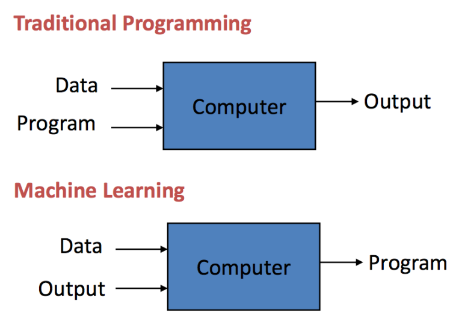

# Data Science Thinking (v1.0)

<!---->

## Introduction

> *"Data science continues to evolve as one of the most promising and in-demand career paths 
for skilled professionals. Today, successful data professionals understand that they must 
advance past the traditional skills of analyzing large amounts of data, data mining, and 
programming skills. In order to uncover useful intelligence for their organizations, 
data scientists must master the full spectrum of the data science life cycle and possess 
a level of flexibility and understanding to maximize returns at each phase of the process."*
 [[1]](https://datascience.berkeley.edu/about/what-is-data-science/)

<!---->

Together with the rapid development of the internet and the wide application of information 
technology in numerous aspects and areas of society (e.g., IoT, mobile application, 
e-commerce, social network, online payment, etc.), the amount of data keeps continuously
increasing. Taking advantage of huge collected data to reveal latent benefit or support the
current business becomes the actual need of several tech companies. 

## Targets

This self-study module is dedicated to those who are not expert data scientists. 
It will provide **primary knowledge** with *the key machine learning concepts and 
the basic recipe* for exploiting raw data *in practice*.

> Machine learning is a field of artificial intelligence that uses statistical techniques
 to give computer systems the ability to "learn" (e.g., progressively improve performance
  on a specific task) from data, without being explicitly programmed. 
  [[2]](https://en.wikipedia.org/wiki/Machine_learning)
  
  

The requirement of **[the assignment](./assignments)** has **3 skill levels** including  **[B]**asic,  **[I]**ntermediate and **[A]**dvanced. 

Please freely **choose the desirable and suitable level for yourself**. 

*Furthermore, if you seriously destine data science to be your career, try hard with the highest level that you can achieve.*