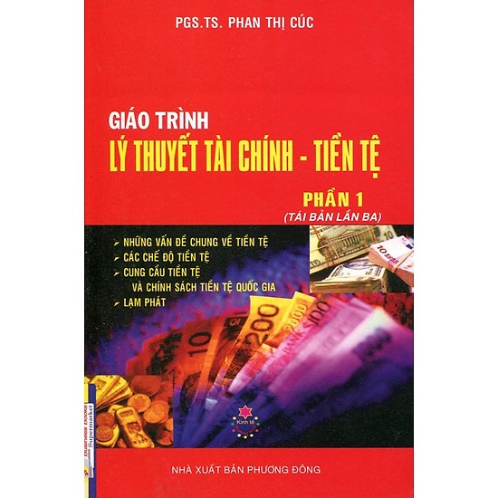
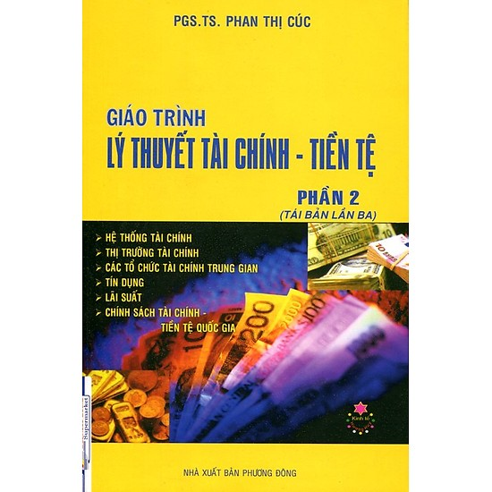

# Lý thuyết tài chính tiền tệ

## 1. Mục tiêu

- Hiểu được bản chất của tiền tệ và các hình thái của nó.

- Tìm hiểu kiến thức lý luận cơ bản, tổng quan về tài chính - tiền tệ và những nội dung chủ yếu của các hoạt động tài chính - tiền tệ.

- Nắm được các khái niệm liên quan như cung cầu tiền tệ, chính sách tiền tệ, lạm phát, tín dụng, hệ thống tài chính, thị trường tài chính....

## 2. Yêu cầu

- Fresher tìm hiểu lý thuyết theo các tài liệu được cung cấp, viết lại báo cáo dạng markdown.

- Phần này làm cá nhân.

## 3. Tài liệu tham khảo 

- Giáo trình lý thuyết tài chính - tiền tệ 1.

- Giáo trình lý thuyết tài chính - tiền tệ 2.

## 4. Bài tập

- Fresher viết bài luận `1500 từ` bằng tiếng việt hoặc `1000 từ` bằng tiếng Anh trình bày về những kiến thức em đã thu thập được về tài chính và tiền tệ

- Thời gian thực hiện : 5 ngày.
