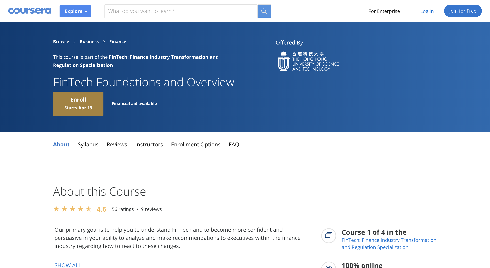

# Introduction to FinTech

## 1. Mục tiêu

- Fresher hiểu được FinTech là gì, có góc nhìn đa chiều về FinTech. 

- Thấy được tác động của FinTech đối với các công ty dịch vụ tài chính. Xu hướng hiện tại và tương lai của FinTech.

- Fresher biết được các lĩnh vực công nghệ ảnh hưởng đến FinTech, bao gồm công nghệ nhận dạng và quyền riêng tư, blockchain và mã hóa, phân tích dữ liệu lớn, AI và tự động hóa,...

## 2. Yêu cầu

- Fresher tìm hiểu lý thuyết theo các tài liệu được cung cấp, viết lại báo cáo dạng markdown.

- Phần này làm cá nhân.

- Fresher sẽ được chia vào 1 trong 2 option sau để tìm hiểu:

**Option 1:** Tìm hiểu cuốn sách Fintech 4.0

Cung cấp bức tranh tổng quan về cuộc cách mạng FinTech. Nắm bắt được dòng chảy cách mạng công nghệ 4.0 đang diễn ra trên thế giới. Quá trình hình thành ý tưởng xây dựng những doanh nghiệp FinTech đầu tiên. Những khó khăn và ưu thế của các công ty này cũng như vai trò của FinTech trong nền kinh tế. Bên cạnh đó,Fresher có thể thấy được sự ảnh hưởng to lớn của FinTech đối với các công ty tài chính truyền thống thông qua các ví dụ minh họa cụ thể.

**Option 2:** Khóa học [FinTech Foundations and Overview](https://www.coursera.org/learn/fintech/home/welcome)

Mục tiêu chính của khóa học là giúp Fresher hiểu FinTech và trở nên tự tin và thuyết phục hơn trong khả năng phân tích và đưa ra khuyến nghị. Cung cấp cái nhìn của một số giáo sư từ các trường kinh doanh hàng đầu ở châu Á cũng như quan điểm từ các chuyên gia trong lĩnh vực FinTech.

Chương trình khóa học bao gồm 4 phần:

- Introduction to FinTech

- FinTech Business Applications

- The Tech of FinTech

- FinTech Implications for Established Business

## 3. Bài tập

- Viết bài luận `1500 từ` bằng tiếng việt hoặc `1000 từ` bằng tiếng Anh về những gì đã tìm hiểu được. Trong bài luận có phần phân tích thực trạng của Fintech Việt Nam hiện nay.

- Thời gian thực hiện : 5 ngày.

