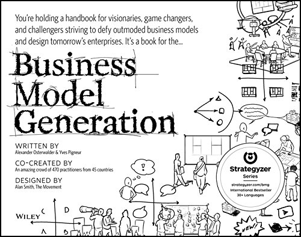

# Business model 

## 1. Mục tiêu

- Tìm hiểu cách thức một tổ chức/doanh nghiệp tạo ra, phân phối và nắm bắt giá trị.

- Hiểu được tầm quan trọng của mô hình kinh doanh đối với một tổ chức.

- Biết cách lập mô hình kinh doanh, đánh giá toàn diện các khía cạnh của một mô hình kinh doanh.

## 2. Key word

- Business model canvas.

- SWOT.

- Chiến lược kinh doanh.

## 3. Yêu cầu

- Fresher tìm hiểu lý thuyết theo các keyword và tài liệu được cung cấp, sau đó tự suy nghĩ ra 1 business model về fintech và bảo vệ nó trong buổi bảo vệ.

- Phần này làm nhóm.

## 4. Tài liệu tham khảo

- Fresher tìm hiểu thêm từ bài viết [Business model research](03-workshop-business-model.md)

- [Mô hình kinh doanh - trái tim của doanh nghiệp](https://engineering.zalopay.vn/business-model/)

- [Open, adaptive strategy](https://conversational-leadership.net/open-strategy/)

- [SWOT analysis](https://en.wikipedia.org/wiki/SWOT_analysis)

- Bussiness model generation

- 

## 5. Đề tài cuối khóa

- 1 nhóm bao gồm 2 bạn lên kế hoạch về 1 mô hình kinh doanh liên quan đến lĩnh vực `Fintech`

- Mình sẽ tổ chức 1 buổi bảo vệ giống như `Shark Tank`, ở đó các bạn sẽ trình bày business model của mình và các kế hoạch marketing, sale, nguồn vốn cần thiết để duy trì hoạt động.

- Thời gian thực hiện: 1 tuần.
